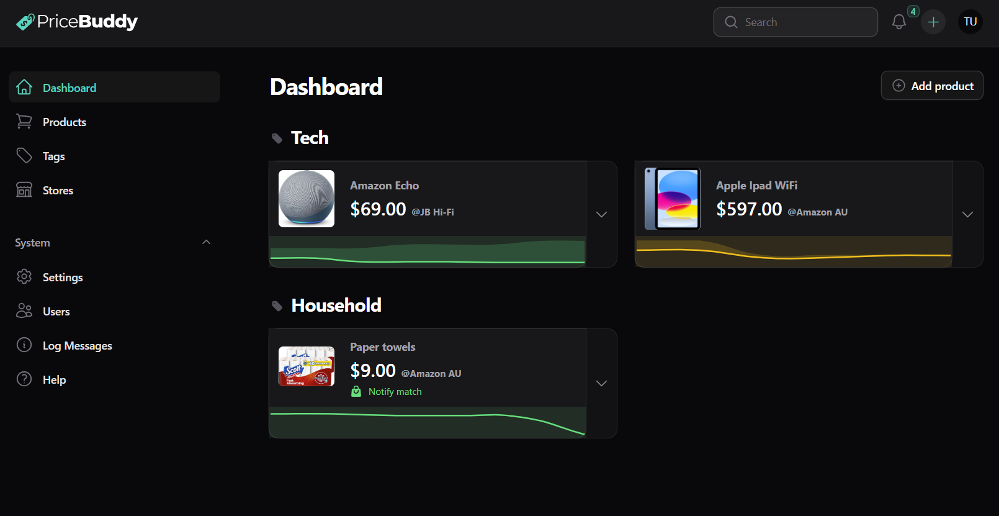
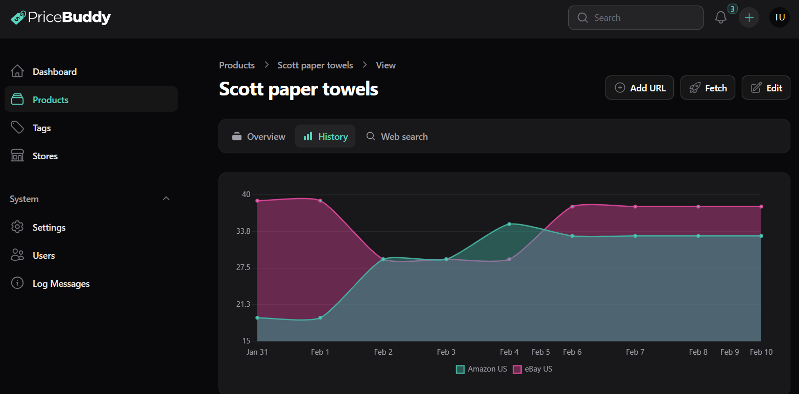

# 

PriceBuddy is an open source, self-hostable, web application that allows users
to compare prices of products from different online retailers. Users can search
for a product and view the prices of that product from different online 
retailers.

## Docs

[Read the docs](https://pricebuddy.jez.me?ref=pb-gh) for all the details.

## Features

* Create and manage stores, you should be able to fetch products from almost any
  store that has a product page.
* Create and manage products, each product can have multiple urls added
  and all the prices will be fetched from those urls daily
* Visualise product price history with charts
* Extract product information via CSS selectors, regular expressions or JSONPath
* Support for SPA/Javascript rendered sites via [Scrapper](https://github.com/amerkurev/scrapper)
* Tagging of products for better organization
* Multi-user support, each user has their own products
* Get notifications via the app, email or pushover when a product price changes to 
  match your preferences
* Light and dark mode & Mobile friendly
* Integration with [SearXNG](https://github.com/searxng/searxng) to search for products
  and add urls within the app.
* Simple setup via docker
* Open source and self-hostable

## Screenshots

Dashboard

Product overview

Product history

## Inspiration

This was largely inspired by [Discount Bandit](https://github.com/Cybrarist/Discount-Bandit) 
which is a very similar application, but it lacks the flexibility to use any store without
code changes.

## Installation

### Docker

Easiest installation method is via docker-compose. Simply make a copy of 
[docker-compose.yml](docker-compose.yml) then tweak it to your liking then run
`touch .env && docker compose up -d`. If using the defaults, the app will be available at
`http://localhost:8080` with the username `admin@example.com` and password `admin`.

### Other methods 

Due to the complexity of the app and its dependencies, other installation methods 
are not recommended but if you are that keen to not use docker, look through the 
`docker/php.dockerfile` and `docker-compose.yml` to see what is needed.

## Affiliate codes

By default, affiliate codes are added to a [couple of stores](config/affiliates.php), 
this supports development of the project. If you would rather not have affiliate codes 
added, you can set `AFFILIATE_ENABLED=false` in your docker compose file or `.env` file. 
If you do disable this, Maybe consider supporting the project in 
[other ways](https://pricebuddy.jez.me//support-project.html).

## Cron / Background tasks

The docker container has a cron job baked in that will take care of background tasks
such as fetching prices and sending notifications.

## Settings and configuration

Most common settings are exposed in the application settings page. For more advanced
settings you can edit the `.env` file in the root of the project.

## Development

This application is built using [Laravel](https://laravel.com) and [Filament](https://filamentphp.com/). 
The development environment uses [Lando](https://lando.dev) to make it easier to 
setup the development environment.

Simply install lando, clone this repo, `cd pricebuddy` and run `lando start` to start 
the development environment.

### Code standards and testing

* Coding standards are enforced via [Laravel Pint](https://laravel.com/docs/11.x/pint)
* Static code analysis via [PHPStan](https://phpstan.org/)
* Test coverage via [PHPUnit](https://phpunit.de/)

### Contributing

Contributions are welcome, please open an issue or a pull request.

## Supporting development

Have a look [here](https://pricebuddy.jez.me//support-project.html) for ways to 
support the project.

## License

See [LICENSE.md](LICENSE.md) for more information.

## Contributors

* [Jeremy Graham](https://jez.me)
